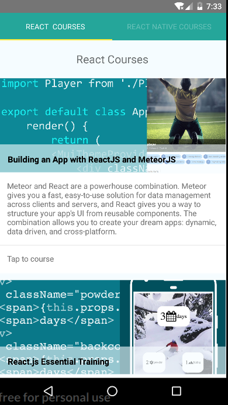

# React Native Courses App

Courses App build using React Native and Materialize based on my Lynda React Courses 
[project](https://github.com/coderade/lynda-react-courses).

### How to use

Download and install the Node.Js and NPM using the [NVM](https://github.com/creationix/nvm).

Install the [yarn](https://yarnpkg.com/en/) following the official 
[documentation](https://yarnpkg.com/lang/en/docs/install/#linux-tab).

Clone the repository and install the node modules.

`yarn install`

Install the React Native Cli globally:

`npm install -g react-native-cli`

***

### Running the App

There is many ways to run this app, using a simulator, real device, running the Android or the IOS version.

To learn how to run RN apps please follow the RN official documentation on the 
[link](https://facebook.github.io/react-native/docs/getting-started.html).

### About RN (React Native)

For more information on React Native please check out [React Native](https://facebook.github.io/react-native/).